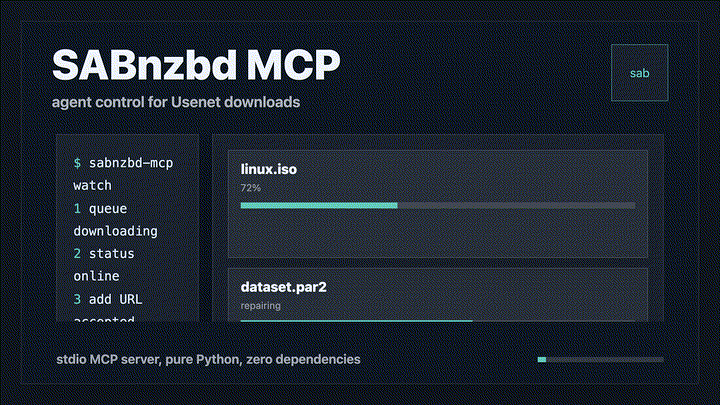

# SABnzbd MCP Server

[](https://github.com/zz-plant/sabnzbd-mcp/actions/workflows/ci.yml)
[](https://opensource.org/licenses/MIT)
[]()
[]()
[](https://modelcontextprotocol.io/)
[]()

<p align="center">
  
</p>

A [Model Context Protocol](https://modelcontextprotocol.io/) server for [SABnzbd](https://sabnzbd.org/) — zero external dependencies. Give any AI agent control over Usenet downloads.

```bash
pip install sabnzbd-mcp
export SABNZBD_URL="http://localhost:8080"
export SABNZBD_API_KEY="your-key"
sabnzbd-mcp
```

## Features

- **No dependencies** — pure Python standard library. One file, zero installs beyond the package itself.
- **15 tools** — full queue, history, config, category, and priority management.
- **Asynchronous Notifications** — automatically pushes completion events to the AI so it doesn't have to poll.
- **Shared `.env` Support** — seamlessly loads from `~/.homelab.env` for unified configuration.
- **Any client** — Claude Desktop, Claude Code, Codex, OpenCode, Cursor, Windsurf, or any MCP host.
- **Minimal** — single file, zero deps. Easy to audit, extend, or fork.

## Tools

| Category | Tool | Description |
|---|---|---|
| **Read** | `sab_queue` | View the download queue — items, speed, progress, NZO IDs |
| | `sab_history` | Browse completed and failed downloads with NZO IDs |
| | `sab_status` | Server health — speed limits, disk space, directories |
| | `sab_categories` | List configured download categories |
| | `sab_get_config` | Get server configuration parameters |
| **Control** | `sab_pause` | Pause all active downloads |
| | `sab_resume` | Resume paused downloads |
| | `sab_set_speedlimit` | Set global download speed limit (percentage or absolute) |
| **Add** | `sab_add_url` | Add an NZB by URL (with optional category) |
| | `sab_add_nzb_file` | Upload an NZB as base64-encoded content |
| **Queue** | `sab_queue_delete` | Remove a download from the queue by NZO ID |
| | `sab_change_priority` | Change priority (low/normal/high/force) of a queued download |
| | `sab_set_category` | Change the category of a queued download |
| **History** | `sab_retry` | Retry failed downloads (by NZO ID or all) |
| | `sab_history_delete` | Remove an item from the download history |

## Configuration

You can provide configuration via environment variables, or by creating a `.env` file in the current directory, or a `~/.homelab.env` file in your home directory (perfect for centralized toolchain configuration!).

| Variable | Required | Default | Description |
|---|---|---|---|
| `SABNZBD_URL` | Yes | `http://localhost:8080` | Base URL of your SABnzbd instance |
| `SABNZBD_API_KEY` | Yes | — | API Key from Settings → General |
| `SABNZBD_SSL_VERIFY` | No | `true` | Set to `false` to disable SSL verification (for self-signed certs) |
| `SABNZBD_POLL_INTERVAL` | No | `15` | Seconds between background polling for completion notifications |

## Client Setup

<details>
<summary><b>Claude Desktop</b></summary>

```json
{
  "mcpServers": {
    "sabnzbd": {
      "command": "sabnzbd-mcp",
      "env": {
        "SABNZBD_URL": "http://localhost:8080",
        "SABNZBD_API_KEY": "your-api-key"
      }
    }
  }
}
```
</details>

<details>
<summary><b>Claude Code / Codex</b></summary>

```bash
claude mcp add sabnzbd -- sabnzbd-mcp \
  -e SABNZBD_URL="http://localhost:8080" \
  -e SABNZBD_API_KEY="your-api-key"
```
</details>

<details>
<summary><b>OpenCode</b></summary>

```json
"sabnzbd": {
  "type": "local",
  "command": ["sabnzbd-mcp"],
  "env": {
    "SABNZBD_URL": "http://localhost:8080",
    "SABNZBD_API_KEY": "your-api-key"
  },
  "enabled": true
}
```
</details>

<details>
<summary><b>Cursor</b></summary>

Add to `.cursor/mcp.json`:
```json
{
  "mcpServers": {
    "sabnzbd": {
      "command": "sabnzbd-mcp",
      "env": {
        "SABNZBD_URL": "http://localhost:8080",
        "SABNZBD_API_KEY": "your-api-key"
      }
    }
  }
}
```
</details>

## Example Prompts

Once connected, your agent can respond to:

> *"What's downloading right now?"* → `sab_queue`

> *"Pause all downloads until tomorrow"* → `sab_pause`

> *"Add this NZB to the games category"* → `sab_add_url`

> *"Show me what finished yesterday"* → `sab_history`

> *"How much disk space is left on the server?"* → `sab_status`

## Automation Pipeline

Combine with other MCP servers for end-to-end media automation:

```
Prowlarr (mcparr) → search indexers
  → qBittorrent / SABnzbd → download
    → Retroarr / Sonarr → sort & import
      → RomM → scan library
```

See [`docs/recipes/`](docs/recipes/) for full pipeline examples.

## Architecture

```
┌──────────────┐    stdin/stdout     ┌──────────────┐    HTTP     ┌───────────┐
│  AI Agent    │ ◄─────────────────► │  sabnzbd-mcp │ ◄─────────► │ SABnzbd   │
│  (Claude,    │    JSON-RPC 2.0     │  (Python)    │             │ (your     │
│   Codex...)  │                     │  stdlib only │             │  server)  │
└──────────────┘                     └──────────────┘             └───────────┘
```

The server is a single self-contained Python file ([`src/sabnzbd_mcp/server.py`](src/sabnzbd_mcp/server.py)) with no dependencies beyond the standard library. It communicates over stdio using line-delimited JSON-RPC 2.0 — no Content-Length framing required.

## Docker

You can easily run this MCP server via Docker alongside your other Arr apps.

**Standard IO via Docker Run:**
```bash
docker build -t sabnzbd-mcp .
docker run -i --rm \
  --env-file ~/.homelab.env \
  sabnzbd-mcp
```

**Network Mode via Docker Compose (using socat):**
See the included `docker-compose.yml` to deploy the MCP server so it listens on a TCP port, which Claude Desktop can connect to over your local network!

## Development

```bash
git clone https://github.com/zz-plant/sabnzbd-mcp.git
cd sabnzbd-mcp
pip install -e ".[dev]"
ruff check src/
python -m pytest tests/
```

## Contributing

See [CONTRIBUTING.md](CONTRIBUTING.md). One PR per tool. Tests required.

## License

MIT

---

## Ecosystem

More open-source projects from [zz-plant](https://github.com/zz-plant):

- [**Stims**](https://github.com/zz-plant/stims) — Browser music visualizer inspired by MilkDrop
- [**Refract**](https://github.com/refract-org/refract) — Open infrastructure for agent-readable knowledge change
- [**neckass**](https://github.com/zz-plant/neckass) — Privacy-first headline generator with on-device AI
- [**ethotechnics.org**](https://github.com/zz-plant/ethotechnics.org) — Essays on ethical technology and human-centered design
